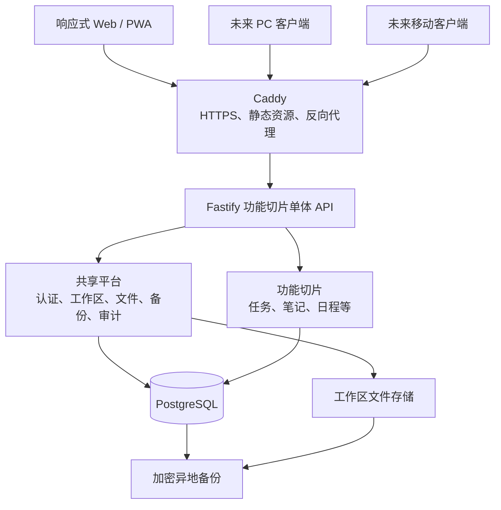

# 个人工作台架构文档

> 状态：架构与当前实现一致性 `VERIFIED`；当前改动发布状态 `PREPARED`<br>
> 更新日期：2026-08-20<br>
> 适用阶段：Web/PWA 首版设计与后续多客户端演进<br>
> 读者：项目所有者、开发者、部署维护者

本架构采用“响应式 Web/PWA + 独立 API + PostgreSQL + 功能切片单体 + 单一工作区根目录”。工作台仍然是一个完整应用；每项功能集中放在自己的前后端目录中，新增功能主要增加文件，只修改少量固定注册点，避免影响已完成功能。服务器上的持久化数据集中在一个工作区根目录中；备份和跨服务器迁移使用带版本、清单和校验和的可移植备份包，不能直接复制运行中的 PostgreSQL 数据目录。

本项目按单人、单工作区使用设计。首版只提供一个固定的 `owner` 账户和登录功能，不实现注册、多用户、角色或功能权限。用户名固定并可在登录页预填，密码在部署时设置，只保存安全哈希而不写入前端或源代码。登录后通过可撤销的服务端长期会话减少重复输入密码。

本文是一份解释型架构基线。它定义边界、约束和演进路径；当前实现和自动化验证状态记录在文末，但这些证据不等同于真实 PostgreSQL 恢复演练、服务器发布或用户正式验收。

## 上下文与约束

当前设计建立在以下产品条件上。任何条件发生实质变化时，都需要重新评估对应章节。

- 系统只服务于个人和一个工作区，首版只有一个固定所有者账户，不建设注册、多用户、角色、组织、租户和计费体系。
- 客户端以在线使用为主，覆盖电脑、平板和手机浏览器。
- 系统不依赖本地设备硬件，也不要求首版提供原生系统能力。
- 后端部署到一台 Linux 服务器，后续可以迁移到另一台服务器。
- 功能会持续增加，每个功能需要能够独立开发和测试，新增时尽量不修改主体代码及其他已完成功能。
- 数据、附件和配置需要能够完整备份、验证、恢复和迁移。
- 业务数据按用户说明不包含敏感内容；数据库口令、备份密钥等运行凭据仍按基础设施秘密管理。
- 后续可能增加 PC 壳应用或原生移动客户端，但首版不同时维护多套 UI。

首版明确不包含以下范围。这些能力只有在需求出现后才进入新的架构决策。

- 不建设微服务、Kubernetes、分布式事务或服务网格。
- 不建设运行时插件系统、功能市场或独立功能生命周期。
- 不实现完整离线编辑、双向同步和自动冲突合并。
- 不默认引入 Redis、消息队列或独立搜索集群。
- 不把成功构建、文档完成或页面能打开视为功能验收。

## 架构决策摘要

下表记录当前基线及选择原因，后续修改这些决策时应补充架构决策记录。

| 领域     | 基线决策                                                  | 原因                                                           |
| -------- | --------------------------------------------------------- | -------------------------------------------------------------- |
| 客户端   | React + Vite + TypeScript 响应式 PWA                      | 工作台以高交互为主，不依赖 SEO 或服务端渲染                    |
| API      | Fastify + REST + OpenAPI                                  | 功能路由边界清晰，契约可供 Web、移动端和 PC 端共同使用         |
| 后端形态 | 功能切片单体                                              | 新功能以新增代码为主，同时保留单进程和单部署面的低运维成本     |
| 数据库   | 单个 PostgreSQL 实例                                      | 支持事务、约束、迁移和后续扩展，不为每个功能建立独立数据库     |
| 文件     | 内容寻址文件存储接口                                      | 附件与数据库分离，可从服务器目录切换到 S3 兼容存储             |
| 认证     | 固定 `owner` 账户 + 服务端持久化 Session                  | 保留公网部署所需的基本保护，同时避免注册、多用户和复杂权限体系 |
| 长期登录 | “记住此设备”会话空闲 180 天、绝对 365 天、每 7 天轮换标识 | 适配个人设备低频重新登录需求，并保留过期和撤销边界             |
| 部署     | Docker Compose + Caddy + 单台 Linux 服务器                | 可重复部署、自动 HTTPS，适合个人工作台的规模                   |
| 迁移     | 逻辑数据库转储 + 文件快照 + 清单校验                      | 避免 PostgreSQL 原始目录的版本和运行状态限制                   |

## 系统总览

系统以 API 为稳定边界。Web/PWA 是第一个客户端，未来 PC 和移动客户端通过相同 API 接入。



对外只暴露 HTTPS 入口。除登录和健康检查外，所有 API 都要求有效 Session；PostgreSQL、工作区文件目录和内部管理端口不直接暴露到公网。

## 仓库结构

代码使用单仓库和 workspace 管理。每个可部署应用独立声明依赖，避免根依赖提升掩盖缺失依赖。

```text
Workspace/
├── apps/
│   ├── web/                       # React Web/PWA
│   │   └── src/
│   │       ├── app/               # 应用壳、路由和导航注册
│   │       ├── features/          # 前端功能切片
│   │       ├── platform/          # 认证、工作区、API、存储、遥测适配
│   │       └── components/ui/     # 通用基础组件
│   └── api/                       # Fastify API
│       └── src/
│           ├── platform/          # 共享平台能力
│           ├── features/          # 后端功能切片
│           └── entrypoints/       # HTTP、OpenAPI 与管理命令
├── packages/
│   └── client-sdk/                # 由 OpenAPI 生成的 TypeScript 客户端
├── contracts/
│   └── openapi.json               # 对外 API 契约产物
├── infra/
│   ├── compose.yaml
│   └── Caddyfile
├── docs/
└── package.json
```

`client-sdk` 只包含传输契约和 API 调用，不包含后端业务对象、数据库模型或 Web UI。未来 Flutter 等非 TypeScript 客户端可根据同一 OpenAPI 文件生成对应语言的客户端。

## 功能隔离与新增方式

本架构追求变更隔离，不追求功能完全模块化。所有功能一起构建和部署；新增功能应以新增自己的文件为主，只触碰少量固定注册点，不建立 manifest、独立版本、依赖拓扑或启停生命周期。

### 共享平台与功能切片

代码只区分共享平台和功能切片。共享平台保持小而稳定，功能切片承载具体业务。

| 区域       | 典型内容                                                                      | 变更原则                                           |
| ---------- | ----------------------------------------------------------------------------- | -------------------------------------------------- |
| 共享平台   | 单账户认证、工作区上下文、数据库连接、文件、备份迁移、日志、错误处理、基础 UI | 新功能默认不能修改；确有多个功能共同需要时单独评审 |
| 功能切片   | 任务、笔记、日程、目标、收藏等                                                | 拥有自己的页面、接口、服务、数据访问和测试         |
| 固定注册点 | Web 路由、导航、API 路由、可选工作台卡片                                      | 新增功能只增加一条显式注册，不写复杂生命周期逻辑   |

功能切片不是可安装插件，也不能独立部署。它只是让代码和测试的影响范围保持局部。

### 后端功能结构

每个后端功能使用相同的轻量目录。只有业务规则明显复杂时，才增加 `domain/`、事件或后台任务等子目录。

```text
features/<feature-id>/
├── index.ts              # 唯一公开出口和路由注册函数
├── routes.ts             # HTTP 传输层
├── schema.ts             # 请求和响应边界校验
├── service.ts            # 业务流程和事务编排
├── repository.ts         # 本功能的数据访问
└── tests/
```

Fastify 的插件封装用于隔离路由前缀、钩子和依赖作用域，但不把功能包装成可动态安装的插件。参见 [Fastify Encapsulation](https://fastify.dev/docs/latest/Reference/Encapsulation/)。

### 前端功能结构

前端按功能组织页面和交互。应用壳只依赖功能的公开出口，其他功能不能导入其内部组件、Query Key 或状态。

```text
features/<feature-id>/
├── index.ts              # 唯一公开出口
├── routes.tsx            # 本功能页面路由
├── api.ts                # 调用生成 SDK 的适配层
├── components/
├── state/                # 仅本功能的客户端状态
└── tests/
```

功能内部出现两三个文件时可以保持扁平；只有目录明显拥挤后再拆分，不提前复制多层样板。

### 固定注册点

新增功能通过少量显式注册接入工作台。显式注册比文件自动扫描更容易审查，也能让 AI 的修改范围保持可见。

| 注册点     | 位置                                         | 新功能允许的修改                         |
| ---------- | -------------------------------------------- | ---------------------------------------- |
| 功能目录   | `apps/web/src/app/feature-catalog.ts`        | 增加名称、路由、分类、关键词与能力声明   |
| Web 路由   | `apps/web/src/app/feature-routes.tsx`        | 增加一条路由导入和配置                   |
| API 注册   | `apps/api/src/app/feature-registry.ts`       | 组装仓库、服务、公共贡献、路由与调度函数 |
| 数据库迁移 | `apps/api/src/platform/database/migrations/` | 新增迁移文件并在 `index.ts` 末尾注册     |

OpenAPI 由已注册路由生成并执行兼容性检查，不要求开发者同时维护第二套手写接口定义。

### 新功能的标准变更范围

增加一个普通功能时，AI 应遵守以下范围。超出范围的修改必须单独说明原因和影响。

| 操作                   | 默认规则                                 |
| ---------------------- | ---------------------------------------- |
| 新增当前功能目录       | 允许                                     |
| 增加固定注册项         | 允许，但不得重写注册器                   |
| 新增数据库迁移         | 允许，优先新增表、索引或可空字段         |
| 修改共享平台或工作台壳 | 默认禁止，需要独立架构理由和全量回归     |
| 修改其他已完成功能     | 默认禁止，需要明确的跨功能需求和目标测试 |
| 提取公共抽象           | 至少三个真实使用方出现相同知识后再评估   |

理想情况下，新增功能不会修改任何已完成功能的实现文件。

### 跨功能协作

功能之间可以协作，但关系必须显式。轻量单体不为普通调用预设事件总线、补偿事务或通用实体系统。

- 功能不能导入另一个功能的内部文件，只能使用其 `index.ts` 公开的稳定接口。
- 跨功能读取优先调用公开查询服务；只有稳定、明确的业务关系才建立外键。
- 工作台总览通过各功能公开的只读摘要组合数据，不直接修改功能内部状态。
- 一个真实业务用例需要同时修改多项数据时，可以在应用服务中建立明确事务，不机械禁止跨功能事务。
- 只有出现多个消费者、异步处理或重试需求后，才引入领域事件或消息队列。
- 全局搜索先通过功能公开的搜索适配器聚合，不直接泄漏 Repository。

所有功能仍随一个 API 一起发布。只有持续的负载、团队所有权或故障隔离证据出现后，才评估拆分服务。

## 后端功能切片契约

后端每一层只承担一种责任。复杂功能可以增加领域层，普通 CRUD 功能不强制创建空目录和无意义抽象。

| 层            | 允许的责任                                  | 禁止事项                   | 强制机制                          |
| ------------- | ------------------------------------------- | -------------------------- | --------------------------------- |
| Route         | 解析 HTTP、边界校验、调用 Service、映射响应 | 直接执行 SQL、包含业务规则 | ESLint import boundary + 路由测试 |
| Service       | 业务流程、事务边界、调用公开功能接口        | 依赖 Fastify request/reply | TypeScript 接口 + 单元测试        |
| Repository    | 本功能数据的读取和持久化                    | 决定业务流程、依赖 HTTP    | import boundary + 数据库集成测试  |
| Schema/Mapper | 输入输出校验和数据形态转换                  | 访问数据库、编排业务流程   | 类型检查 + 边界测试               |
| Platform      | PostgreSQL、文件、日志和外部服务适配        | 包含具体功能业务规则       | 端口接口 + 受限修改规则           |

所有外部输入只在边界验证。Fastify 支持基于 JSON Schema 的请求验证和响应序列化；即使业务数据不敏感，响应 schema 仍能防止返回内部字段并保持客户端契约稳定。参见 [Fastify Validation and Serialization](https://fastify.dev/docs/latest/Reference/Validation-and-Serialization/)。

## 请求上下文与中间件策略

HTTP、后台任务和管理命令都必须初始化请求上下文。业务方法不逐层传递上下文参数。

请求上下文至少包含以下字段：

- `requestId`：关联日志、错误和审计记录。
- `userId`：固定所有者账户的稳定 ID；不用于角色或功能权限判断。
- `clientType`：`web`、`desktop`、`mobile` 或 `system`。
- `clientVersion`：用于兼容性诊断，不作为隐式业务分支。
- `workspaceId`：防止错误连接到另一套工作区数据。

共享中间件统一处理 HTTPS 代理信息、请求 ID、Session 验证、工作区校验、登录限速、CSRF 防护、结构化日志、审计和错误映射。除登录和健康检查外，每个路由必须声明 `authenticated`，缺少策略时注册失败。认证成功后统一注入固定所有者的 `userId` 和部署时确定的 `workspaceId`；普通客户端不得自行切换。备份恢复、迁移和密码重置命令不通过普通业务 API 暴露，只能在服务器管理环境中执行。

## API 与多客户端演进

API 是客户端迁移的核心资产。客户端不能直接依赖数据库结构、后端目录或仅浏览器可用的内部调用。

### API 约定

API 使用 `/api/v1` 版本前缀和资源型 REST 路径。OpenAPI 是跨语言契约，能够让不同客户端在不读取后端源代码的情况下理解接口；参见 [OpenAPI Specification](https://spec.openapis.org/oas/latest.html)。

- 列表接口必须分页，并声明稳定排序。
- 请求和响应字段使用 `camelCase`。
- 时间使用带时区的 ISO 8601 字符串，服务端存储 UTC 时间点。
- 可修改记录包含 `version`；过期版本更新返回 `409 Conflict`。
- 错误统一为 `error.code`、`error.message`、`error.details` 和 `requestId`。
- 文件上传使用独立端点和大小、类型、哈希校验，不嵌入普通 JSON。
- 删除默认遵循对应功能定义的回收或保留策略，不默认物理删除附件。
- OpenAPI 变更在 CI 中执行兼容性检查，破坏性修改必须进入新版本路径。

不要使用只适合 TypeScript 客户端的 tRPC 作为唯一公共契约。后端内部仍可共享 TypeScript 类型，但跨进程边界以 OpenAPI 为准。

### 客户端演进路线

不同端复用传输契约和业务规则，不强求复用所有 UI。下表定义推荐路径。

| 阶段     | 客户端形态                                      | 复用内容                                        | 新增内容                       |
| -------- | ----------------------------------------------- | ----------------------------------------------- | ------------------------------ |
| 首版     | 响应式 Web/PWA                                  | OpenAPI SDK、Session 语义、工作区契约、领域术语 | Web 路由、PWA 清单、响应式 UI  |
| PC 增强  | 保持 PWA，必要时增加 Tauri/Electron 壳          | Web UI、SDK、API                                | 窗口、托盘、协议链接等壳能力   |
| 移动增强 | 先使用 PWA，需求成立后选择 React Native/Flutter | OpenAPI、错误语义、资源 ID、并发规则            | 原生导航、手势、通知和本地缓存 |

PWA 需要 Web App Manifest 和 HTTPS 才能满足主流浏览器的安装条件；不支持安装的平台仍可作为普通网站使用。参见 [MDN PWA 安装说明](https://developer.mozilla.org/en-US/docs/Web/Progressive_web_apps/Guides/Making_PWAs_installable)。

首版只缓存带内容哈希的静态资源，不缓存 API 业务响应，也不提供离线修改队列。该限制用于避免陈旧数据和未设计的冲突处理，不以数据敏感性为前提。如果以后要求断网编辑，需要单独设计 IndexedDB、本地操作日志、服务端幂等键、冲突展示和合并策略。

### 单账户认证与长期会话

首版只有一个固定账户：稳定账户 ID 和用户名为 `owner`，登录页可直接预填用户名，用户通常只需输入密码。不提供注册、账户列表、角色、功能权限、邮箱验证、验证码或面向多用户的找回密码流程。密码不能以明文写死在代码、镜像、前端环境变量或仓库配置中；部署时通过管理命令初始化，使用 Argon2id 加盐哈希保存。具体参数遵循 [OWASP Password Storage Cheat Sheet](https://cheatsheetseries.owasp.org/cheatsheets/Password_Storage_Cheat_Sheet.html) 的当前建议。

登录使用服务端 Session，浏览器 Cookie 只保存高熵、无业务含义的会话标识，Session 记录持久化到 PostgreSQL。生产 Cookie 使用 `__Host-` 前缀以及 `Secure`、`HttpOnly`、`SameSite=Lax`、`Path=/`，令牌不进入 `localStorage` 或 `sessionStorage`。服务端只保存会话标识的哈希，不保存可直接复用的明文令牌。登录成功、修改或重置密码后都要创建、轮换或撤销会话标识。Cookie 会话和过期策略参考 [OWASP Session Management Cheat Sheet](https://cheatsheetseries.owasp.org/cheatsheets/Session_Management_Cheat_Sheet.html)。

登录页提供“记住此设备”，针对个人设备默认勾选：

| 模式       | 服务端空闲期限 | 绝对期限 | Cookie                                                             |
| ---------- | -------------- | -------- | ------------------------------------------------------------------ |
| 记住此设备 | 180 天         | 365 天   | 持久 Cookie；`Max-Age` 等于服务端剩余有效期                        |
| 临时登录   | 12 小时        | 24 小时  | 不设置 `Expires`/`Max-Age` 的会话 Cookie；服务端期限仍具有最终权威 |

“记住此设备”只是面向用户的简洁文案，实际含义是在当前浏览器创建一条长期登录会话，不识别硬件身份，也不使用设备指纹或 IP 绑定。同一台设备中的不同浏览器是不同会话；在同一浏览器再次登录也会创建新的会话。设置页以“登录会话”为管理单位，显示粗粒度客户端标签，例如“Chrome · Windows”；标签可由用户改名，但不能被当作安全身份。

每次登录形成一个不可跨越绝对期限的 Session Family，期限和轮换规则如下：

1. 长期会话在登录时固定 `absoluteExpiresAt = createdAt + 365 天`，以后不得顺延；`idleExpiresAt = min(now + 180 天, absoluteExpiresAt)`。
2. 有效请求视为活动。服务端至多每 24 小时持久化一次新的 `lastSeenAt` 和 `idleExpiresAt`，并重发 Cookie；`Max-Age = max(0, min(idleExpiresAt, absoluteExpiresAt) - now)`。
3. 临时会话不向 Cookie 写入 `Expires` 或 `Max-Age`，服务端固定执行 12 小时空闲和 24 小时绝对期限。浏览器关闭通常会移除 Cookie，但浏览器的会话恢复功能可能保留它，因此不能把“关闭浏览器”作为安全失效边界。
4. 登录时生成首个标识；此后第一个满足 `now - lastRotatedAt >= 7 天` 的有效请求触发轮换。新旧标识属于同一 Session Family，旧标识只再接受 2 分钟以容纳并发请求，且不能触发第二次轮换。
5. 空闲期限和绝对期限都由服务端在每个受保护请求上强制检查。达到任一期限、主动退出、撤销会话、修改密码或重置密码后，相关 Family 的当前标识和 2 分钟过渡标识立即全部失效。

`auth_sessions` 至少保存 `sessionId`、`sessionFamilyId`、`currentTokenHash`、`previousTokenHash`、`previousTokenGraceUntil`、`clientLabel`、`createdAt`、`lastSeenAt`、`idleExpiresAt`、`absoluteExpiresAt`、`lastRotatedAt` 和 `revokedAt`。浏览器只能得到当前明文标识；数据库中的哈希不能直接用作 Cookie。设置页允许查看登录会话、撤销单个会话、退出当前会话和“退出其他会话”。无法登录时使用服务器管理命令 `workbench auth reset-owner-password` 重置密码；修改或重置密码必须撤销全部 Session Family，不建设邮件找回流程。

认证接口只包括登录、读取当前会话、退出、列出会话、撤销指定会话、退出其他会话和修改密码，不提供注册接口。首次部署使用 `workbench auth init-owner` 交互式设置密码；账户未初始化时 readiness 明确失败，命令不得静默覆盖已有密码哈希。

所有修改数据的请求除 Session Cookie 外还要校验同源 CSRF Token 和 `Origin`/`Referer`；`SameSite` 仅作为附加保护。CSRF 设计参考 [OWASP CSRF Prevention Cheat Sheet](https://cheatsheetseries.owasp.org/cheatsheets/Cross-Site_Request_Forgery_Prevention_Cheat_Sheet.html)。登录接口按来源地址和固定账户记录连续失败次数，执行速率限制和递增等待，但不能形成永久锁死。

## 数据与存储架构

服务端采用单一 PostgreSQL 数据库。功能隔离体现在代码目录、Repository、迁移命名和测试边界，不为每个功能建立独立数据库或 PostgreSQL schema。

### 数据表与迁移边界

所有功能使用同一个应用 schema，并由一个全局迁移器按确定顺序执行迁移。功能通过表所有权约定保持边界，而不是依赖复杂数据库隔离。

- Repository 默认只访问本功能拥有的数据表和共享平台公开的数据接口。
- 稳定、明确的跨功能业务关系可以使用外键；临时展示关系不能随意固化为强耦合。
- 已执行迁移不可修改；结构变化通过新的、优先向后兼容的迁移完成。
- 业务事实保存在功能表中；搜索索引、摘要和缓存属于可重建派生数据。
- 业务表不保存 `ownerId` 或用户权限字段；所有记录天然属于当前单一工作区。
- 需要恢复能力的数据使用明确的软删除或回收站策略，不把 `deletedAt` 机械加入所有表。

### 单一工作区根目录

后端适合使用一个工作区根目录统一管理持久化内容。Docker 容器通过 bind mount 使用这些路径，容器本身保持可替换；Docker 官方将 bind mount 定义为主机路径与容器路径的直接映射，同时提醒这种方式依赖主机目录结构。参见 [Docker Bind Mounts](https://docs.docker.com/engine/storage/bind-mounts/)。

默认服务器根目录为 `/srv/workbench`，结构如下：

```text
/srv/workbench/
├── .workbench-workspace.json     # 工作区 ID、格式版本和创建信息
├── config/
│   ├── app.yaml                  # 可迁移的非敏感配置
│   └── features/                 # 少量功能级非敏感配置
├── secrets/                      # 0600 权限；不进入明文备份包
├── database/
│   └── postgres/                 # 运行中的 PGDATA，不直接热复制
├── storage/
│   ├── objects/                  # 内容寻址的正式附件
│   └── quarantine/               # 尚未校验完成的上传
├── backups/
│   └── local/                    # 本机备份副本，不是唯一副本
├── exports/                      # 用户主动导出的文件
├── logs/                         # 可轮转，不属于业务事实
├── migration-reports/            # 迁移与恢复报告
├── runtime/                      # 锁、PID、维护模式标记
└── temp/                         # 可随时清理的临时文件
```

服务器外部只保留一个最小定位配置，例如 `/etc/workbench/bootstrap.env`。它只包含 `WORKBENCH_ROOT`、`workspaceId` 和启动所需的定位状态，不保存业务数据、附件或用户配置。

所有数据库中的文件引用必须使用可跨平台的正斜杠相对对象键，不能保存 `/srv/workbench` 之类的绝对主机路径。上传流程以流方式写入 `quarantine`，同步执行大小限制与 SHA-256 计算，再用原子硬链接进入内容寻址的 `objects`；旧备份中使用反斜杠的对象键仍需兼容读取和迁移。

正式对象必须先持久化，再提交引用它的数据库记录。失败时允许留下待垃圾回收的孤立对象，但不能提交指向不存在文件的数据库记录。

### 运行目录不等于可移植备份

工作区根目录解决“数据放在哪里”，可移植备份解决“怎样安全地带走数据”。二者不能混为一谈。

PostgreSQL 官方说明，直接文件系统复制要获得可用备份，通常必须关闭数据库服务器，或使用能够产生一致性快照的文件系统；不能在数据库运行时直接复制一半目录。参见 [PostgreSQL 文件系统级备份](https://www.postgresql.org/docs/current/backup-file.html)。

因此采用以下规则：

- 日常备份和跨服务器迁移使用 `pg_dump --no-owner --no-acl --exclude-table-data=public.auth_sessions --exclude-table-data=public.auth_login_attempts -Fc`，不复制运行中的 `PGDATA`。
- 停机冷迁移可以复制整个根目录，但仅作为同一 PostgreSQL 主版本和兼容平台之间的受控方案。
- 任何物理数据库目录复制都必须包含完整数据库集群和 WAL，并经过恢复演练。
- 数据库应用角色和权限由目标环境重新创建，不依赖源服务器的集群级角色状态。
- 容器镜像、应用代码和缓存不进入工作区业务备份。
- 本机 `backups/local` 只是恢复速度优化；至少一份加密备份必须离开该服务器。

`pg_dump` 能在数据库被并发使用时生成内部一致的快照，归档格式也适合使用 `pg_restore` 在其他机器和架构上恢复；`--exclude-table-data` 只排除匹配表的数据而保留表定义。参见 [PostgreSQL SQL Dump](https://www.postgresql.org/docs/current/backup-dump.html) 和 [PostgreSQL pg_dump](https://www.postgresql.org/docs/current/app-pgdump.html)。

## 备份、恢复与迁移

备份系统属于共享平台，不由各功能自行实现。完整备份覆盖整个应用数据库的持久业务状态和附件，只排除清单中明确列出的易失认证数据；复杂功能可以提供额外数据不变量校验器，但不维护自己的备份格式。

### 可移植备份包

每个完整备份产生一个不可变目录或压缩包。备份任务不能把已有 `backups/` 递归包含进新备份。

```text
workbench-backup-<timestamp>/
├── manifest.json                 # 工作区、应用、数据库迁移和备份格式版本
├── database/
│   └── workbench.dump            # 排除易失认证数据的 pg_dump 自定义格式
├── storage/
│   └── objects/                  # 不可变对象快照，允许包含未引用对象
├── config/
│   ├── app.yaml                  # 可迁移的非敏感配置
│   └── features/                 # 完整功能配置子树
├── release.json                  # 应用发布版本和已执行迁移
├── checksums.sha256              # 包内文件校验和
├── restore-plan.json             # 目标版本和迁移要求
└── secrets.enc                   # 可选；使用单独口令或密钥加密
```

日志、临时文件、运行锁、`auth_sessions` 与 `auth_login_attempts` 的表数据以及可重建索引默认不进入可移植备份；表结构仍由迁移或数据库转储恢复。清单必须记录被排除的易失表。固定所有者账户的密码哈希随数据库业务备份恢复，但现有登录会话不迁移；恢复后的新实例要求重新登录，避免同一会话在两套实例同时有效。

### 在线备份一致性

附件采用不可变、内容寻址存储，数据库保存对象哈希、相对键和展示元数据。物理删除使用 24 小时宽限期的延迟垃圾回收；备份与清理任务共用 `runtime/backup.lock` 互斥，从而避免数据库快照引用的文件在复制前消失。首版复制完整对象快照；即使快照包含数据库转储未引用的新对象，恢复结果仍然完整，后续可以安全清理孤立对象。通用上传限制为 50 MiB，书籍封面进一步限制为 5 MiB；上传、校验和下载均采用流式处理，下载支持 HTTP Range。

完整在线备份按以下顺序执行：

1. 获取备份锁并记录工作区、应用发布和数据库迁移版本。
2. 执行 `pg_dump --no-owner --no-acl --exclude-table-data=public.auth_sessions --exclude-table-data=public.auth_login_attempts -Fc`，生成内部一致且不含现有会话和登录失败记录的数据库快照。
3. 在暂停垃圾回收期间复制不可变对象目录；额外对象可以存在，但不能缺少被引用对象。
4. 复制完整的可迁移 `config/` 配置树；明文 secrets 不进入普通备份包。
5. 生成逐文件 SHA-256 和总清单。
6. 在隔离目录执行结构校验和抽样读取。
7. 原子重命名为 `complete` 备份目录；失败时删除未完成目录，并在数据库记录失败状态。
8. 将完成的加密备份复制到服务器之外的存储。

默认保留策略可以从每日 7 份、每周 4 份和每月 12 份开始，但必须根据数据体积和恢复目标调整。保留数量不是成功标准；至少需要定期执行真实恢复演练。

### 恢复验收

恢复必须进入新的空工作区，不能覆盖现有工作区。只有通过全部检查后，才允许切换正式流量。

| 检查       | 通过条件                                                                                                               |
| ---------- | ---------------------------------------------------------------------------------------------------------------------- |
| 包完整性   | 清单存在，所有 SHA-256 匹配，无 `incomplete` 标记                                                                      |
| 版本兼容   | 备份格式、应用版本和迁移路径受支持                                                                                     |
| 数据库恢复 | `pg_restore` 无未处理错误，迁移完整                                                                                    |
| 功能数据   | 关键功能记录计数和业务不变量校验通过                                                                                   |
| 附件       | 无缺失引用，抽样文件哈希和可读性通过                                                                                   |
| 认证       | 恢复后、应用启动前再次清空 `auth_sessions` 和 `auth_login_attempts`；两表行数均为 0，固定 `owner` 能使用原密码重新登录 |
| 运行状态   | readiness、读写删除烟雾测试和后台任务启动通过                                                                          |
| 报告       | 生成带时间、版本和检查结果的恢复报告                                                                                   |

备份任务显示成功只表示备份产物生成完成。只有在隔离环境成功恢复并通过验收后，才能将该备份链标记为 `VERIFIED`。

### 跨服务器迁移流程

迁移使用“预检、复制、验证、试运行、切换”的受控流程。源服务器在新实例验收前保持不变。

1. 预检目标服务器磁盘、权限、应用版本、端口和 PostgreSQL 兼容性。
2. 在源服务器进入维护模式，等待写请求和后台任务结束。
3. 生成新的完整可移植备份并验证校验和。
4. 将备份复制到目标服务器的新工作区根目录。
5. 恢复数据库、附件、非敏感配置和必要的加密 secrets；在应用启动前执行 `TRUNCATE public.auth_sessions, public.auth_login_attempts`，作为排除易失认证数据的第二道保障。
6. 运行数据库迁移，确认两个易失认证表均为 0 行，再执行关键功能校验、附件校验和端到端烟雾测试。
7. 先使用临时域名或本地 hosts 进行试运行，再切换 DNS 或反向代理。
8. 将源实例置为只读并保留一个回退窗口，不自动合并两边的新数据。
9. 回退窗口结束且用户明确确认后，再单独处理源数据归档或删除。

迁移失败时继续使用源实例。系统不得自动删除源目录、自动覆盖目标目录或把两个工作区的数据拼接在一起。

### 备份和迁移故障处理

下表定义必须在实现和测试中覆盖的主要故障。

| 故障               | 处理原则                                               |
| ------------------ | ------------------------------------------------------ |
| 磁盘空间不足       | 预检失败即停止；运行中失败保留不完整标记并清理临时空间 |
| 根目录不可访问     | API 进入只读或不可就绪状态，不回退到容器临时目录       |
| 工作区 ID 不匹配   | 拒绝启动和恢复，要求显式选择正确工作区                 |
| 备份包被篡改或损坏 | SHA-256 校验失败，禁止恢复                             |
| 应用版本过旧       | 禁止打开更高格式版本，先升级应用或选择兼容恢复路径     |
| secrets 缺失       | 禁止解密相关数据；给出重新配置或提供密钥的明确路径     |
| 迁移中断           | 目标保持非正式状态，源保持可用，从幂等步骤重新开始     |
| 双实例同时写入     | 使用实例租约和 workspaceId 锁阻止第二个写实例启动      |

## 前端边界

Web 客户端把服务端状态和本地交互状态分开，避免全局状态容器逐渐承载所有功能。

- TanStack Query 管理 API 数据、缓存失效和请求状态。
- React 组件状态管理局部交互。
- 表单状态由 React Hook Form 管理。
- 只有跨多个功能且无法放入 URL、服务端状态或应用壳的状态，才进入全局客户端状态。
- 功能切片不能直接读取另一个功能的 Query Key、Store 或内部组件。
- 工作台壳只负责编排导航、布局、命令面板和固定注册点。
- 前端统一处理未登录和 Session 过期；业务功能不各自实现登录跳转。
- 系统只有固定所有者，不建设角色和功能权限；API 仍必须验证 Session，隐藏按钮不能代替认证。

响应式验收至少覆盖窄手机、平板、普通桌面和宽屏桌面视口。PWA 安装与普通浏览器访问属于两条独立验收路径。

## 部署与运行

首版在一台 Linux 服务器上使用 Docker Compose。Docker 官方支持使用生产覆盖文件为单机部署设置不同端口、环境变量、重启策略和日志服务；参见 [Docker Compose 生产部署](https://docs.docker.com/compose/how-tos/production/)。

| 部署面     | 责任                                 | 健康检查                        | 回滚方式                             |
| ---------- | ------------------------------------ | ------------------------------- | ------------------------------------ |
| Caddy/Web  | HTTPS、静态资源、`/api` 代理         | 静态资源与代理探测              | 切回上一 Web 镜像                    |
| API        | 功能接口、单账户认证、业务和管理命令 | `/health/live`、`/health/ready` | 切回上一兼容 API 镜像                |
| PostgreSQL | 业务事实和事务                       | 连接、迁移版本、只读检查        | 从已验证备份恢复，不直接降级数据目录 |
| 文件存储   | 附件和导出文件                       | 根目录权限、容量、抽样读写      | 切回只读旧根或恢复对象快照           |
| Backup Job | 备份、校验和异地复制                 | 最近成功时间和最近恢复演练时间  | 保留上一条完整备份链                 |

所有持久化路径都从 `WORKBENCH_ROOT` 派生，Compose 文件不得把业务数据写入匿名容器卷。数据库端口只在内部网络开放，Caddy 是唯一公网入口，并强制 HTTPS 后再允许使用 `Secure` Session Cookie。

结构化日志必须包含 `requestId`、`featureId`、固定 `userId`、`clientType`、结果和耗时。日志不得记录 Session 标识、Cookie、密码、恢复密钥或完整请求正文。

## AI 实现约束

第一版可以保留已确认的大部分功能，但 AI 必须按纵向切片逐项实现，不能一次生成所有前端后端代码后再集中集成。第一个切片用于验证共同骨架，不代表缩减第一版范围。

### 单次任务边界

每个 AI 开发任务都要声明目标功能、允许修改的路径、禁止修改的稳定区域、验收标准和需要运行的回归测试。

| 区域                      | AI 默认权限  | 额外要求                              |
| ------------------------- | ------------ | ------------------------------------- |
| 当前功能目录              | 可新增和修改 | 完成该功能的前端、API、数据和测试闭环 |
| 固定注册点                | 可做最小追加 | 不重写注册结构，不顺带整理无关代码    |
| 新数据库迁移              | 可新增       | 不修改已执行迁移，提供回退或恢复说明  |
| 共享平台、应用壳、基础 UI | 默认不可修改 | 必须先说明多个功能的共同需要和影响面  |
| 其他已完成功能            | 默认不可修改 | 必须有明确跨功能需求和针对性回归证据  |

项目应通过根目录 `AGENTS.md` 固化这些约束，并为新功能提供一个轻量目录模板。模板规定文件职责和测试门，不预先生成未使用的事件、领域层或 Repository 抽象。

### 完整第一版的推进顺序

较完整的第一版通过阶段门控制质量，而不是任意删减已确认范围。

1. 先完成共享平台：固定账户登录、长期 Session、工作台壳、数据库、文件、错误处理、日志、工作区根目录和备份恢复骨架。
2. 完成一个真实功能切片，贯通 Web、API、数据库、Session 校验、测试和部署。
3. 按同一模板分批实现相对独立的第一版功能，每项通过自己的验收后再进入主导航。
4. 独立功能稳定后实现跨功能关联、搜索和工作台总览，避免早期关系反复变化。
5. 最后执行全量回归、真实备份恢复和跨服务器迁移演练。

AI 生成的代码和文档初始状态为 `PREPARED`。只有实际执行类型检查、测试、迁移和恢复演练并保存结果后，相关范围才能标记为 `VERIFIED`；正式使用验收仍需要用户确认。

## 测试策略

测试既验证功能，也验证切片边界、数据可恢复性和多客户端契约。

| 层级         | 范围                                             | 关键要求                                              |
| ------------ | ------------------------------------------------ | ----------------------------------------------------- |
| 单元测试     | Service、复杂领域规则、纯转换                    | 不连接数据库；每个业务不变量有明确断言                |
| 功能集成测试 | 路由、Repository、迁移                           | 使用隔离测试数据库和动态 ID，允许并行运行             |
| 契约测试     | OpenAPI、生成 SDK、错误语义                      | 检测破坏性变更，验证响应与 schema 一致                |
| Web E2E      | 固定账户登录、长期登录、工作台、至少一个功能切片 | 覆盖多个视口、记住设备、会话轮换和失效 Session        |
| 备份恢复测试 | dump、附件、配置和清单                           | 在空目录真实恢复，执行数据和附件校验                  |
| 迁移演练     | 旧版本到新版本、跨服务器                         | 覆盖中断、磁盘满、版本不兼容和回退                    |
| 边界测试     | import、路由、认证策略和数据表所有权             | 防止功能直接引用另一个功能内部实现或漏掉 Session 校验 |

每次修复备份、恢复、迁移或数据损坏问题时，都必须增加对应回归测试。仅测试 API 返回 200 不能证明数据内容、附件或恢复链正确。

## 发布、回滚与首个纵向切片

首个实现应选择一个小而真实的功能，例如“快速记录”，纵向贯穿固定注册点、Web 路由、API、数据库、附件、Session 校验、日志、备份和恢复。该切片用于证明架构，而不是宣称整个工作台完成或缩减第一版范围。

发布遵循以下规则：

- Web、API 和迁移产物使用同一发布版本。
- 数据库迁移采用 expand-contract，先增加兼容结构，再切换读写，最后在后续版本清理旧结构。
- 运行迁移前生成完整备份，并记录当前镜像和数据库迁移版本。
- 新版本必须能读取上一版本写入的数据；不能满足时必须提供停机迁移和恢复方案。
- 功能只有在切片验收通过后才进入生产导航；必要的发布开关由应用统一管理，关闭入口不能删除数据。
- 回滚优先切回上一镜像；如果新版本已经写入不兼容数据，则从迁移前已验证备份恢复到新工作区。

“完成”需要同时满足代码质量门、目标功能验收、备份恢复演练和部署健康检查。文档、脚手架和未执行测试保持 `PREPARED`，不能升级为 `VERIFIED`。

## 开放风险与后续决策

以下问题不阻止确认当前架构，但会触发局部或整体架构调整。

| 决策问题                         | 触发影响                                         |
| -------------------------------- | ------------------------------------------------ |
| 是否要求断网编辑和自动同步       | 需要本地数据库、操作日志、幂等接口和冲突解决模型 |
| 原生移动端预计何时开始           | 若近期开始，应提前选择 OIDC 提供方和 PKCE 流程   |
| 附件总容量达到多少时切换对象存储 | 当前单文件上限已定；总量影响备份窗口和 S3 迁移   |
| 是否需要端到端加密               | 影响搜索、预览、密钥恢复和服务器迁移方式         |
| 是否会开放给家庭成员或协作者     | 需要重新设计租户、共享、权限和审计模型           |
| 全局中文搜索是否是核心能力       | 需要针对中文分词、索引更新和备份重建做独立选型   |
| 恢复时间和可接受数据丢失量是多少 | 决定备份频率、PITR、异地存储和演练周期           |

在这些问题得到答案前，不提前加入同步引擎、对象存储集群或多租户框架。

## 架构验证记录

本节分别记录设计、代码、浏览器、真实数据库和发布证据，避免用一类检查代替另一类检查。

| 检查                     | 结果       | 证据边界                                                                                                     |
| ------------------------ | ---------- | ------------------------------------------------------------------------------------------------------------ |
| 架构与实现一致性         | `VERIFIED` | 已核对功能切片、三个固定注册点、单 PostgreSQL、单工作区根目录、认证、文件和备份实现，没有并列冲突方案        |
| 可执行约束               | `VERIFIED` | 2026-08-20 的完整检查已通过格式、Lint、类型检查、113 项测试和生产构建                                        |
| OpenAPI 契约             | `VERIFIED` | 已重新生成 OpenAPI 与 SDK 类型，生成结果没有产生未解释的契约漂移                                             |
| 浏览器关键流程           | `VERIFIED` | 已在桌面和 `390 × 844` 手机视口检查登录、导航、12 个功能、弹窗固定区、主题、功能方格、表单重置和页面横向溢出 |
| 文件与备份自动化         | `VERIFIED` | 自动化测试覆盖 50 MiB 流式上传、5 MiB 书籍封面、Range/ETag、上传与清理并发、备份互斥、清单和恢复时间语义     |
| Markdown 结构            | `VERIFIED` | 已检查标题层级、代码围栏、相对链接和 UTF-8 中文，结构问题为 0                                                |
| 真实 PostgreSQL 恢复演练 | `VERIFIED` | 已在隔离 PostgreSQL 17 空目标执行迁移、12 个功能数据与两个对象文件的备份恢复；迁移到 `022`，会话按设计清空   |
| 当前改动服务器发布       | `PREPARED` | 本次审阅改动尚未提交、推送或部署；线上仍是审阅前版本                                                         |
| 用户正式验收             | 未完成     | 自动化检查和浏览器审阅不能替代用户对实际内容、长期登录、Android 安装与日常使用的确认                         |

## 下一步

当前首版主体与十二个功能切片已经进入实现和实际使用阶段，后续重点不再是搭骨架，而是持续证明数据可恢复和长期运行稳定：

1. 为正式服务器建立自动备份、校验、异地复制和磁盘容量告警。
2. 每次迁移、文件或备份逻辑变更后执行真实 PostgreSQL 空目标恢复演练。
3. 持续记录 PC 与 Android 实际使用中的 `ACCEPTED` 项和仍需调整的体验问题。
4. 只有附件总量、离线要求或原生客户端需求达到明确阈值后，才评估对象存储或客户端架构调整。
