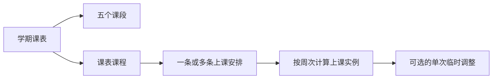

# 课程表功能设计文档

课程表应作为个人工作台中的一个独立功能，用最少的录入成本管理学期、教学周、五个课段和每门课的具体上课安排。第一版以手动录入为主，同时做好编辑、临时调整、归档、备份以及 PC 和 Android 两套布局；本阶段只确定设计，不实现代码。

| 项目           | 结论                                                         |
| -------------- | ------------------------------------------------------------ |
| 文档状态       | `PREPARED`，等待实现和用户验收                               |
| 功能名称       | 课程表                                                       |
| `featureId`    | `timetable`                                                  |
| 前端路由       | `/features/timetable`                                        |
| 功能边界       | 完全独立，不读取、关联或修改“课程管理”功能                   |
| 默认第一周周一 | 2026-09-07，属于可修改的建议值，不代表学校已公布研究生开课日 |
| 默认作息       | 采用西安电子科技大学研究生院 2020 年通知中的五个连续上课时段 |
| 首版录入方式   | 用户逐门手动添加，不做教务系统导入                           |

## 1. 设计结论

第一版采用“学期课表 + 五个课段 + 课表课程 + 多条上课安排”的结构。用户先确认学期和第一周周一，再逐门添加课程；每条安排选择星期、课段和具体教学周，首页据此计算并展示任意一周的课表。

核心决定如下：

- 一门课可以有多条上课安排，适应同一门课每周上两次、教室不同或周次不同的情况。
- 周次保存为明确勾选的集合，而不是只保存“单周、双周”文字，因此能够表示 1—8 周、1/3/6/10 周等任意组合。
- 首页统一显示“课 1”至“课 5”，课 5 默认对应学校作息中的第 9—11 节；用户仍可修改所有课段名称和时间。
- 第一周周一是日期计算基准。2026-09-07 只是根据 9 月 5 日报到后首个周一给出的初始建议，首次进入时必须让用户确认。
- 教师和教室是添加页中的正式字段，但允许暂时留空，并在卡片上明确显示“教师待定”或“教室待定”。
- 课程、学期和临时调整都能继续编辑；课程和学期先归档，再允许永久删除。
- PC 使用周课表网格，Android 使用按天查看的纵向课段列表，不把七列网格硬塞进窄屏。

## 2. 功能边界

课程表只负责个人的上课时间安排，不承担教学资料、作业、课堂记录或学习进度管理。这个边界能避免新增功能影响已经完成的其他功能。

### 2.1 与其他功能的关系

课程表是独立纵向功能切片。它只共享工作台的登录、外壳、主题、搜索、总览、快速创建、备份和统一错误处理。

- 不读取“课程管理”的数据。
- 不给“课程管理”添加字段、按钮或反向链接。
- 不建立跨功能外键、同步任务或自动复制规则。
- 两个功能中都可能出现“课程”一词，但课程表内部统一称为“课表课程”。
- 总览页可以同时显示两个功能各自贡献的内容，但二者通过工作台公共协议独立提供数据。

### 2.2 第一版包含的能力

第一版要覆盖个人使用时最常见、且对课表正确性直接有影响的能力。

- 创建、切换、编辑、归档和删除学期课表。
- 设置第一周周一和教学周总数。
- 查看和修改五个默认课段。
- 创建、编辑、归档、恢复和永久删除课表课程。
- 为一门课添加一条或多条上课安排。
- 按星期、课段和具体周次显示课表。
- 显示课程名称、教师、教室、周次和时间。
- 检测同一周、同一天、同一课段的冲突。
- 对单次课程执行停课、调课、换教室或换教师。
- 在工作台总览、搜索和快速创建中提供轻量接入。
- 自动进入现有数据库备份与恢复流程。

### 2.3 第一版不包含的能力

以下能力不会进入第一版，避免把个人课表做成复杂教务系统。

- 教务系统登录、抓取、Excel 或图片识别导入。
- 学分、成绩、作业、资料、笔记和考勤管理。
- 多人共享课表、邀请、班级或教师账户。
- 选课、抢课、空教室查询和校园地图导航。
- 自动识别法定节假日和学校临时教学安排。
- 推送通知、桌面小组件和系统日历双向同步。

## 3. 默认学期和作息

系统必须提供可直接使用的默认值，但默认值不能伪装成已经确认的 2026 级研究生教学通知。用户第一次创建学期时能在一个页面中确认或修改所有关键日期和时间。

### 3.1 第一周计算规则

学期保存“第一周周一”而不是“报到日”。第 N 周的周一按 `第一周周一 + (N - 1) × 7 天` 计算，周二至周日再分别增加 1 至 6 天。

2026 级研究生新生 9 月 5 日报到已有学院通知依据，但通知没有说明研究生新生正式上课日期。因此新学期向导建议填入 2026-09-07，并同时显示“建议值，待课表通知确认”。用户之后修改基准日时，系统先预览受影响的日期，再统一重算上课实例。

### 3.2 默认五个课段

默认时间来自[西安电子科技大学研究生院《关于调整研究生作息时间的通知》](https://gr.xidian.edu.cn/info/1037/8923.htm)。该通知发布于 2020 年，设计中只把它作为可编辑模板；若学校后来发布新作息，用户可以直接修改。

| 工作台课段 | 学校原节次 | 默认时间    | 默认说明           |
| ---------- | ---------- | ----------- | ------------------ |
| 课 1       | 第 1—2 节  | 08:30—10:05 | 上午第一段         |
| 课 2       | 第 3—4 节  | 10:25—12:00 | 上午第二段         |
| 课 3       | 第 5—6 节  | 14:00—15:35 | 下午第一段         |
| 课 4       | 第 7—8 节  | 15:55—17:30 | 下午第二段         |
| 课 5       | 第 9—11 节 | 19:00—21:25 | 晚间三小节合并显示 |

课段名称、开始时间、结束时间和说明都可以修改。上课安排只引用课段，不复制时间；因此修改课段时间后，同一学期内引用它的所有课程会一起更新。

### 3.3 作息校验

系统在保存作息时进行基础校验，以阻止无法正常显示的设置。

- 课段名称不能为空且在同一学期内不能重名。
- 开始时间必须早于结束时间。
- 两个课段默认不能重叠；确需重叠时必须二次确认。
- 课段按开始时间排序，用户不能通过拖动造成显示顺序与时间顺序相反。
- 第一版固定保留五个课段，不增加任意数量的节次编辑器。

## 4. 领域模型

课程表的数据以学期为边界。课表课程保存共同信息，上课安排保存重复规则，上课实例由系统计算，临时调整只覆盖其中一次。



### 4.1 学期课表

学期是所有日期、课段和课程的容器，一次只设一个当前学期。

| 字段       | 规则                                   |
| ---------- | -------------------------------------- |
| 学期名称   | 必填，例如“2026—2027 学年秋季学期”     |
| 简称       | 必填，例如“研一上”                     |
| 第一周周一 | 必填，必须是周一                       |
| 总周数     | 必填，默认 20，可设 1—30               |
| 当前学期   | 同一时间只能有一个                     |
| 状态       | 使用中、已归档                         |
| 周末显示   | 默认关闭；添加周六或周日课程后自动打开 |

修改第一周周一或总周数属于高影响操作。保存前展示旧值、新值和受影响课程数量；缩短学期导致某些已选周次超出范围时，不允许直接保存，必须先调整这些课程或明确移除超出周次。

### 4.2 课表课程

课表课程保存一门课在本学期内的公共信息，并至少包含一条上课安排。

| 字段     | 规则                                             |
| -------- | ------------------------------------------------ |
| 课程名称 | 必填，最多 80 个字符                             |
| 教师     | 可填写一个或多个姓名；暂不确定时允许为空         |
| 颜色     | 从主题安全色板选择，并同时使用文字和边框表达状态 |
| 简称     | 可选，窄卡片优先显示简称                         |
| 备注     | 可选，例如课程群或特殊要求                       |
| 状态     | 使用中、已归档                                   |

课程本身不保存唯一的星期和教室，因为同一门课可能一周上多次，或不同安排使用不同教室。这些信息放在上课安排中。

### 4.3 上课安排

每条上课安排定义一组重复出现的课。用户可以在同一个添加窗口中继续添加安排，不必重复创建课程。

| 字段     | 规则                                         |
| -------- | -------------------------------------------- |
| 星期     | 必填，周一至周日                             |
| 课段     | 必填，课 1 至课 5                            |
| 上课周次 | 必填，至少选择一周                           |
| 教室     | 可选，空值显示“教室待定”                     |
| 教师覆盖 | 可选；仅当本安排教师与课程默认教师不同才填写 |

周次集合在界面上压缩为便于阅读的范围。例如选择 1、2、3、4、6、8、9、10 周时显示为“1—4、6、8—10 周”。

### 4.4 上课实例和临时调整

上课实例不要求为每一周预先写入大量重复数据，而是在查询某周时根据学期、安排和周次计算。临时调整保存对某一个实例的覆盖。

临时调整支持以下类型：

- 停课：该次实例不在普通课表中显示，保留“已停课”痕迹。
- 调课：改到另一天和另一个课段，原位置显示调课提示。
- 换教室：只替换该次实例的教室。
- 换教师：只替换该次实例的教师。

如果之后修改了原始上课安排，系统必须检查已有临时调整是否仍能定位到对应实例；不能静默丢弃调整。

## 5. 信息架构

课程表只增加一个主入口，复杂设置通过主页面中的设置抽屉进入，不在工作台侧边栏继续增加子菜单。

| 页面或界面            | 用途                                     |
| --------------------- | ---------------------------------------- |
| `/features/timetable` | 当前学期、周切换、课程网格或日列表       |
| 新建或编辑课程弹窗    | 课程信息、安排和周次选择                 |
| 课程详情抽屉          | 查看完整信息、编辑、临时调整和归档       |
| 课表设置抽屉          | 学期、第一周、总周数、五个课段和显示设置 |
| 已归档列表            | 恢复或永久删除课程与学期                 |

所有长表单使用固定标题栏和固定底部操作栏，中间内容独立滚动。关闭按钮、表单标题、取消和保存按钮在滚动后仍然可见，避免重现其他长弹窗顶部消失的问题。

## 6. 课程表首页

首页以“我这一周什么时候上课”为主要问题，不使用占据大量空间的功能说明横幅。功能说明放入标题旁的信息按钮，首次进入时可展示一次简短引导。

### 6.1 顶部操作区

PC 和 Android 都保留相同的核心操作，但根据屏幕宽度重新排列。

- 页面标题“课程表”和紧凑的当前学期选择器。
- 上一周、下一周、“本周”按钮和“第 N 周”标签。
- 当前周日期范围，例如“09.07—09.13”。
- “添加课程”主按钮。
- “课表设置”和“已归档”次级入口。

当前日期不在学期范围内时，顶部显示“学期未开始”或“学期已结束”，但仍允许浏览任意教学周。

### 6.2 PC 布局

PC 使用周网格，横向是星期，纵向是五个课段。默认显示周一至周五；开启周末或存在周末课程时显示七天。

```text
┌ 课程表 ─ 2026—2027 秋 ─ 第 1 周 ─ 09.07—09.13 ── 添加课程 ┐
│           周一        周二        周三        周四        周五 │
│ 课1       课程卡       ·          课程卡       ·          ·   │
│ 08:30     10:05                                               │
│ 课2       ·           课程卡       ·          课程卡       ·   │
│ 10:25     12:00                                               │
│ 课3       ……                                                   │
│ 课4       ……                                                   │
│ 课5       ……                                                   │
└───────────────────────────────────────────────────────────────┘
```

左侧课段栏同时显示课段名和时间。空单元格可以点击，打开已预填星期和课段的添加课程窗口。网格不因课程内容变长而改变列宽，溢出内容使用省略号并可通过悬停或点击查看完整信息。

### 6.3 Android 布局

Android 不显示缩小版周网格，而使用“周次条 + 星期标签 + 当日课段列表”。左右滑动切换日期，上下滚动查看课段。

```text
课程表      第 1 周       ＋
09.07 — 09.13        本周
一 7  二 8  三 9  四 10  五 11

课1  08:30—10:05
┌ 课程名称
│ 教室 · 教师
│ 1—8、10—16 周
└────────────────────

课2  10:25—12:00
暂无课程
```

底部或右下角保留添加按钮。学期、周次和设置放在顶部菜单中；重要操作不能只依靠横向滑动，必须同时提供可点击按钮。

### 6.4 课程卡片

课程卡片在首页直接显示用户关心的信息，不要求进入详情后才能确认教师和教室。

| 信息     | 显示规则                               |
| -------- | -------------------------------------- |
| 课程名称 | 第一行，优先简称，完整名称可展开       |
| 教室     | 第二行，未知时显示“教室待定”           |
| 教师     | 第二或第三行，未知时显示“教师待定”     |
| 周次     | 压缩显示，例如“1—8、10—16 周”          |
| 临时状态 | 调课、停课、换教室使用文字徽标         |
| 冲突     | 使用“时间冲突”徽标和图标，不只依赖颜色 |

点击卡片打开详情抽屉。一个单元格内有多个课程时，卡片按纵向排列并显示冲突提示，不能互相覆盖。

### 6.5 空状态和加载状态

首页必须区分没有学期、没有课程、当前周没有课程和加载失败，避免都显示成同一句空状态。

- 没有学期：显示三步初始化入口。
- 已有学期但没有课程：显示“添加第一门课程”。
- 本周没有课程：说明本学期仍有课程，并提供周切换。
- 请求失败：显示错误原因和“重新加载”，不把失败误报为空数据。
- 加载中：使用与网格结构一致的骨架屏，避免页面跳动。

## 7. 首次设置和课表设置

第一次进入课程表时使用一个短向导完成必要设置。后续所有设置仍可从课表首页修改。

### 7.1 首次设置向导

向导共三步，每一步都可以返回修改。

1. 确认学期名称、简称、第一周周一和总周数。
2. 检查五个默认课段及其时间。
3. 保存学期并选择“添加第一门课程”或“稍后添加”。

第一步为 2026 级用户预填 2026-09-07，但在日期下方明确写明：9 月 5 日是报到日，研究生开课日尚未从现有通知中确认，请按最终课表修改。

### 7.2 学期管理

用户可能只在研一和研二有课，但设计支持多个学期，以便保留历史课表。

- 新建学期时可以复制上一学期的五个课段，不复制课程。
- 切换当前学期后，首页、总览和搜索中的近期课程都以当前学期为准。
- 归档学期后默认只读，历史课表仍可查看。
- 恢复学期后才能继续编辑。
- 永久删除学期只在已归档状态出现，并明确提示将同时删除该学期内的课程、安排和调整。

### 7.3 显示设置

显示设置保持精简，只保留确实影响课表阅读的选项。

- 是否显示周六和周日。
- 课程卡优先显示完整名称还是简称。
- Android 首次打开显示今天还是周一。
- 当前时间线是否显示；默认开启，仅在当前周和当天出现。

主题不在课程表中单独设置。所有背景、文字、边框、状态色、遮罩、滚动条、表单和卡片必须使用工作台统一主题变量，确保之后新增主题能够覆盖整个功能。

## 8. 添加和编辑课程

添加窗口以一次完成一门课为目标。表单可以很长，因此标题、关闭按钮和底部保存区固定，中间区域滚动。

### 8.1 表单结构

表单按从公共信息到具体安排的顺序组织，避免用户在每个上课时段重复填写课程名称。

1. 基本信息：课程名称、简称、默认教师、颜色和备注。
2. 上课安排：星期、课段、教室、教师覆盖和周次。
3. 更多安排：继续添加另一组星期、课段、教室和周次。
4. 保存摘要：显示本课程一周上几次、共涉及多少个上课实例。

用户从空网格点击添加时，星期和课段自动带入；从全局“快速创建”进入时，只预填当前学期。

### 8.2 周次选择器

周次选择器用等宽小方格显示 1 至学期总周数，每个周次都有清晰的选中状态和键盘焦点。

快捷操作包括：

- 全选；
- 单周；
- 双周；
- 前半学期；
- 后半学期；
- 清空。

快捷操作只是改变明确选择的周次集合，用户随后仍可逐周增删。保存前用文字再次概括，例如“已选择 1—8、10、12 周，共 10 周”。

### 8.3 冲突检测

当两个使用中的安排在同一学期、至少一个相同周次、同一星期和同一课段重叠时，系统判定为时间冲突。

冲突检查在选择周次时即时执行，也在 API 保存时再次执行。界面列出冲突课程和具体周次；考虑到真实课表中可能需要临时保留重叠信息，用户可以二次确认后保存，但首页必须持续显示冲突徽标。

### 8.4 编辑和归档

编辑复用添加表单，并显示变更会影响的教学周。归档课程不会删除历史信息，也不会继续出现在普通课表、近期课程和总览中。

- 使用中的课程可以编辑或归档，不能永久删除。
- 已归档课程可以查看、恢复或永久删除。
- 永久删除需要再次输入课程名称或执行明确二次确认。
- 删除一门已归档课程时同时删除其上课安排和临时调整。

## 9. 工作台公共能力接入

课程表默认显示在侧边栏和全部功能页。用户如果不想看到它，只能在工作台设置中隐藏入口，隐藏不会停用功能或删除数据。

### 9.1 功能注册

实现时建议使用以下注册信息，使它与现有功能保持一致。

| 注册项     | 设计值                             |
| ---------- | ---------------------------------- |
| 名称       | 课程表                             |
| 分类       | 时间与提醒                         |
| 图标       | 新增语义清晰的课表或日历时钟图标   |
| 默认侧边栏 | 显示                               |
| 搜索关键词 | 课表、课程、教师、教室、周次、上课 |
| 生命周期   | 实现和验收前为 `in-development`    |

### 9.2 总览贡献

总览页只显示轻量信息，不复制完整周课表。

- “今日课程”最多显示当天全部课表课程。
- “下一堂课”显示课程名称、开始时间、教室和距离上课的时间。
- 当前没有课程时显示“今天没有课”，不占据大面积空白。
- 总览数据只来自课程表自身，不查询其他功能。

### 9.3 搜索和快速创建

全局搜索可以匹配课程名称、简称、教师、教室和备注。结果点击后打开课程表并定位到该课程最近一次上课的周次。

快速创建新增“课表课程”入口。首版不接入全局通知能力，避免未设计好通知时间、重复提醒和时区规则就产生错误提醒。

## 10. 数据和接口设计

实现继续遵守模块化单体规则，在课程表自己的前端和后端目录中完成业务逻辑，只在固定注册点追加一项。

### 10.1 建议代码位置

代码放置位置与现有功能切片保持一致。

```text
apps/web/src/features/timetable/
apps/api/src/features/timetable/
apps/api/src/platform/database/migrations/0xx-timetable.ts
```

不得为了实现课表重写工作台外壳、总览渲染器、搜索聚合器、认证平台或其他已完成功能。共享代码修改必须是课程表接入公共协议所必需的最小变更。

### 10.2 数据表

建议使用带 `timetable_` 前缀的独立表，避免名称冲突并明确所有权。

| 表                        | 内容                                         |
| ------------------------- | -------------------------------------------- |
| `timetable_semesters`     | 学期、第一周周一、总周数、当前状态和显示设置 |
| `timetable_time_blocks`   | 每学期五个课段的名称、起止时间和说明         |
| `timetable_courses`       | 课表课程公共信息和归档状态                   |
| `timetable_meetings`      | 星期、课段、教室和教师覆盖                   |
| `timetable_meeting_weeks` | 每条安排明确选中的周次                       |
| `timetable_adjustments`   | 单次停课、调课、教室或教师覆盖               |

所有表都使用现有工作台的时间戳、ID、单 owner 数据边界和迁移规范。发布后只能新增迁移，不能修改已经发布的迁移。

### 10.3 接口范围

接口按资源和生命周期操作划分，具体请求与响应在实现时写入 OpenAPI 并生成客户端类型。

| 接口组                                        | 主要能力                                         |
| --------------------------------------------- | ------------------------------------------------ |
| `/api/v1/timetable/semesters`                 | 学期列表、创建、编辑、设为当前、归档、恢复和删除 |
| `/api/v1/timetable/semesters/:id/time-blocks` | 读取和更新五个课段                               |
| `/api/v1/timetable/courses`                   | 课程列表、创建、详情和编辑                       |
| `/api/v1/timetable/courses/:id/archive`       | 归档课程                                         |
| `/api/v1/timetable/courses/:id/restore`       | 恢复课程                                         |
| `/api/v1/timetable/occurrences`               | 按学期和周次查询计算后的上课实例                 |
| `/api/v1/timetable/adjustments`               | 创建、编辑和移除单次调整                         |

所有接口继续经过现有登录、同源校验和 CSRF 保护。课程表不创建新的认证方式，也不把会话或数据写入浏览器 Web Storage。

### 10.4 日期和备份规则

课程表的日期以 `Asia/Shanghai` 下的本地日历日期计算。第一周周一、课程日期和调课日期使用日期值，课段使用本地时间值，避免 UTC 转换导致课程跨日。

数据进入现有 PostgreSQL 数据库后，自动包含在工作台整体备份中。附件目录没有课程表专属内容；恢复数据库后，学期、课程、周次、作息和临时调整应一起恢复。

## 11. 交互、可访问性和主题约束

课程表需要在信息密度较高的场景下保持可读，不能依赖单一颜色或只适合鼠标的操作。

- 所有图标按钮都有可读标签和悬停说明。
- 课程卡颜色同时配合文字、边框或图标，不以颜色作为唯一含义。
- 选周方格、星期标签、学期选择和弹窗可使用键盘操作。
- 焦点进入弹窗后被限制在弹窗内，关闭后回到触发按钮。
- PC 网格最低支持 1280 像素宽度；更窄时逐步切换到平板或按天布局。
- Android 触控目标不小于工作台现有组件标准，课段列表不使用横向小字表格。
- 所有 UI 使用语义主题变量，包括日期选择器、原生表单控件、滚动条、空状态、冲突徽标、遮罩和弹窗固定区。
- 操作成功或失败使用现有统一反馈组件；保存失败时保留用户已填写内容。

## 12. 验收标准

以下标准全部通过后，课程表功能才能从 `PREPARED` 进入自动化层面的 `VERIFIED`；实际使用是否顺手仍由用户单独验收。

### 12.1 核心规则验收

核心规则测试需要覆盖日期、周次和重复安排的边界。

- 新学期默认出现五个正确课段，课 5 为 19:00—21:25。
- 第一周周一可修改，任意第 N 周日期按规则正确重算。
- 2026-09-07 明确标记为建议值，不显示成官方确定的开课日期。
- 一门课可以同时保存多条安排，每条安排可以选择任意周次。
- 当前周只显示被选中的上课实例。
- 教师、教室和压缩后的周次直接出现在课程卡片中。
- 重叠周次的同一课段会触发冲突提示，不重叠周次不会误报。
- 单次停课或调课只影响指定实例。
- 课程归档后从普通课表消失，恢复后重新出现；永久删除只对已归档课程开放。
- 学期归档、恢复和级联永久删除遵守二次确认规则。

### 12.2 页面和设备验收

页面验收同时覆盖宽屏、窄屏、空状态和长内容。

- PC 周网格的卡片不重叠、不撑坏列宽，周末按设置正确显示。
- Android 使用按天列表，星期切换和周切换都可点击完成。
- 长课程名、多位教师、长教室名和离散周次不会遮挡其他内容。
- 添加与编辑弹窗滚动后，标题、关闭按钮、取消和保存始终可见。
- 深色、浅色及之后新增的主题都能覆盖全部课表 UI。
- 加载中、空数据、请求失败和学期范围外状态能够明确区分。

### 12.3 独立性和回归验收

独立性测试确保新增课程表不会改变其他功能。

- 课程表前后端代码位于自己的 feature slice。
- 课程表数据库没有指向其他功能业务表的外键。
- 禁用或隐藏课程表入口后，其他功能照常使用。
- 课程表总览、搜索和快速创建贡献满足公共协议。
- “课程管理”功能的代码、数据和测试不因课程表实现而改变。
- 备份并恢复后，课表数据与恢复前一致。
- 仓库规定的 lint、typecheck、test 和 build 全部通过。

## 13. 实现顺序

后续开始编码时按可验证的纵向顺序推进，避免先堆完页面再补数据规则。

1. 新增数据库迁移、领域类型和周次日期计算测试。
2. 实现学期与五个课段接口，并完成首次设置流程。
3. 实现课表课程、上课安排、周次选择和冲突检测。
4. 实现 PC 周网格与 Android 按天布局。
5. 实现单次临时调整、归档、恢复和永久删除。
6. 接入功能目录、侧边栏、总览、搜索和快速创建。
7. 生成 OpenAPI 客户端，执行完整回归和备份恢复验证。

## 14. 资料依据和待确认事项

当前设计所依据的官方资料只确认了默认作息和报到日，没有确认 2026 级研究生正式开课日。因此日期设计必须以用户可修改为前提。

- [西安电子科技大学研究生院：关于调整研究生作息时间的通知](https://gr.xidian.edu.cn/info/1037/8923.htm)：作为五个默认课段的来源。
- [西安电子科技大学集成电路学部：关于 2026 年暑假放假安排的通知](https://sme.xidian.edu.cn/html/tzgg/2026/0717/3658.html)：确认 2026 级研究生新生 9 月 5 日报到，但未写明新生开课日。

正式实现前只需再确认两项：学校或学院公布的 2026 级研究生第一周日期，以及本学期实际教学周总数。即使暂时无法确认，也可以使用 2026-09-07 和 20 周开始录入，之后通过学期设置统一修正。
